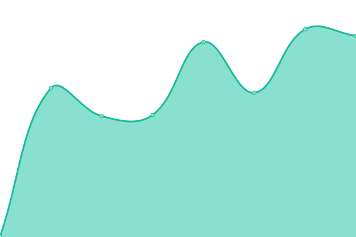
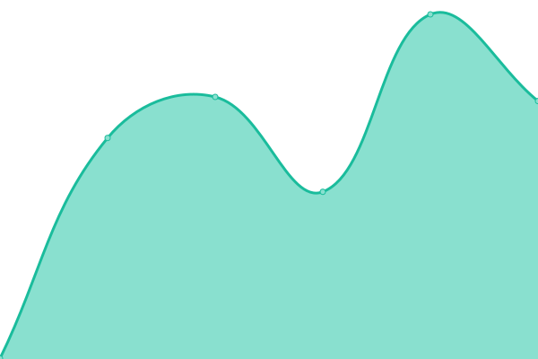
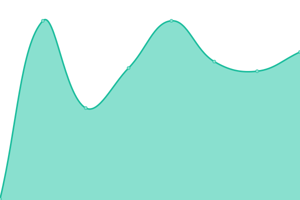
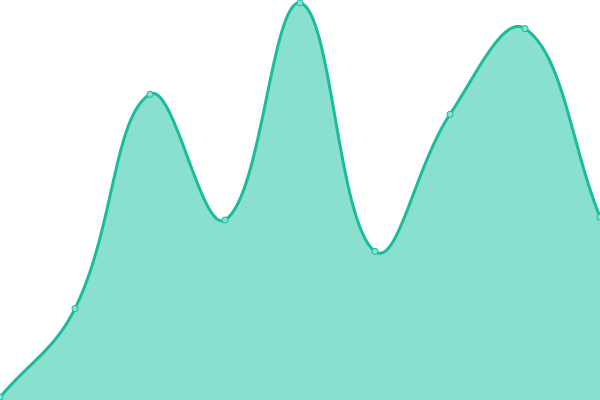

# [📈 Live Status](https://omeroastore-ops.github.io/uptime-monitor): <!--live status--> **🟩 All systems operational**

This repository contains the open-source uptime monitor and status page for [omeroastore-ops](https://omeroastore-ops.github.io/uptime-monitor), powered by [Upptime](https://github.com/upptime/upptime).

With [Upptime](https://upptime.js.org), you can get your own unlimited and free uptime monitor and status page, powered entirely by a GitHub repository. We use [Issues](https://github.com/omeroastore-ops/uptime-monitor/issues) as incident reports, [Actions](https://github.com/omeroastore-ops/uptime-monitor/actions) as uptime monitors, and [Pages](https://omeroastore-ops.github.io/uptime-monitor) for the status page.

<!--start: status pages-->
<!-- This summary is generated by Upptime (https://github.com/upptime/upptime) -->
<!-- Do not edit this manually, your changes will be overwritten -->
<!-- prettier-ignore -->
| URL | Status | History | Response Time | Uptime |
| --- | ------ | ------- | ------------- | ------ |
|  [Secret Bar Menu](https://secretbar-bs.de/?menu=true) | 🟩 Up | [secret-bar-menu.yml](https://github.com/omeroastore-ops/uptime-monitor/commits/HEAD/history/secret-bar-menu.yml) | 

 502ms
     
 | 

<a href="https://omeroastore-ops.github.io/uptime-monitor/history/secret-bar-menu">100.00%</a>
    

|  [Safe Bar Menu](https://safe-bs.de/#/menu) | 🟩 Up | [safe-bar-menu.yml](https://github.com/omeroastore-ops/uptime-monitor/commits/HEAD/history/safe-bar-menu.yml) | 

 431ms
     
 | 

<a href="https://omeroastore-ops.github.io/uptime-monitor/history/safe-bar-menu">100.00%</a>
    

|  [Brackwasser Cinema](https://omeroastore-ops.github.io/brackwasser-cinema/) | 🟩 Up | [brackwasser-cinema.yml](https://github.com/omeroastore-ops/uptime-monitor/commits/HEAD/history/brackwasser-cinema.yml) | 

 60ms
     
 | 

<a href="https://omeroastore-ops.github.io/uptime-monitor/history/brackwasser-cinema">100.00%</a>
    

|  [KARO Kebab Menu](https://omeroastore-ops.github.io/KAROKEBABHOUSE/#menu) | 🟩 Up | [karo-kebab-menu.yml](https://github.com/omeroastore-ops/uptime-monitor/commits/HEAD/history/karo-kebab-menu.yml) | 

 32ms
     
 | 

<a href="https://omeroastore-ops.github.io/uptime-monitor/history/karo-kebab-menu">100.00%</a>
    

<!--end: status pages-->

[**Visit our status website →**](https://omeroastore-ops.github.io/uptime-monitor)

## 📄 License

- Powered by: [Upptime](https://github.com/upptime/upptime)
- Code: [MIT](./LICENSE) © [Anand Chowdhary](https://anandchowdhary.com), supported by [Pabio](https://pabio.com)
- Data in the `./history` directory: [Open Database License](https://opendatacommons.org/licenses/odbl/1-0/)
